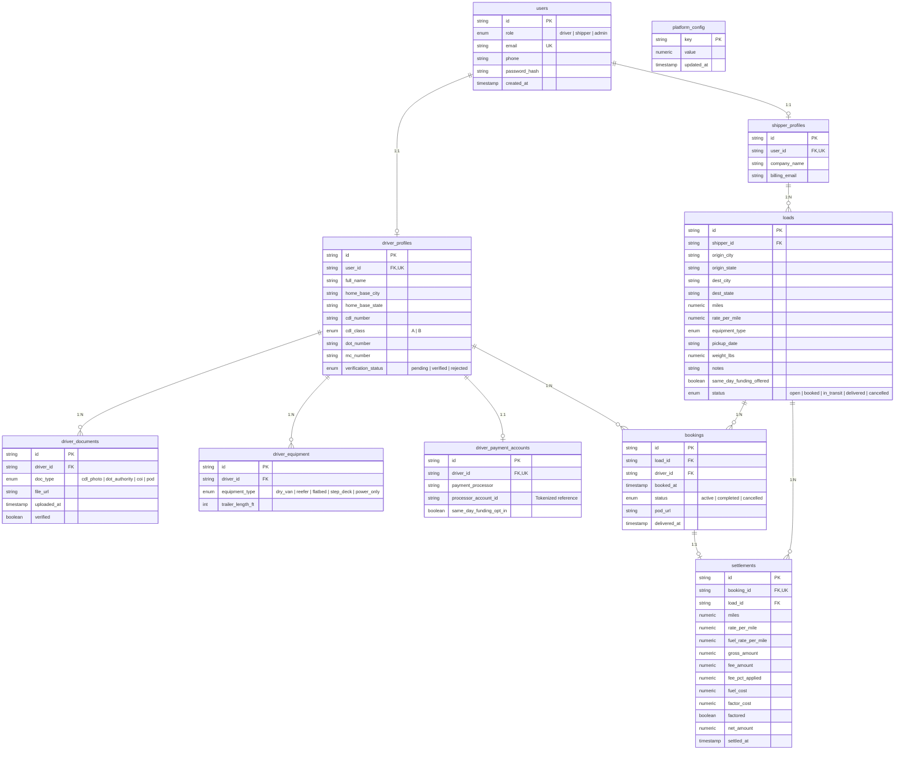

# Entity Relationship Diagram (ERD) - America Ships On Click

This document describes the PostgreSQL database architecture for **America Ships On Click**.

## Database Overview

The schema enforces strict financial history preservation via `ON DELETE RESTRICT` constraints on settlements and bookings.

### Views:
- **`public_ledger_view`**: Joined view for public settlement data without exposing driver or shipper identity.
- **`settlement_totals_view`**: Aggregate materialized view computing real-time count, total miles, gross, fee, fuel cost, factor cost, and net amount paid to carriers directly from DB rows (never incremented counters).

## Mermaid Diagram

